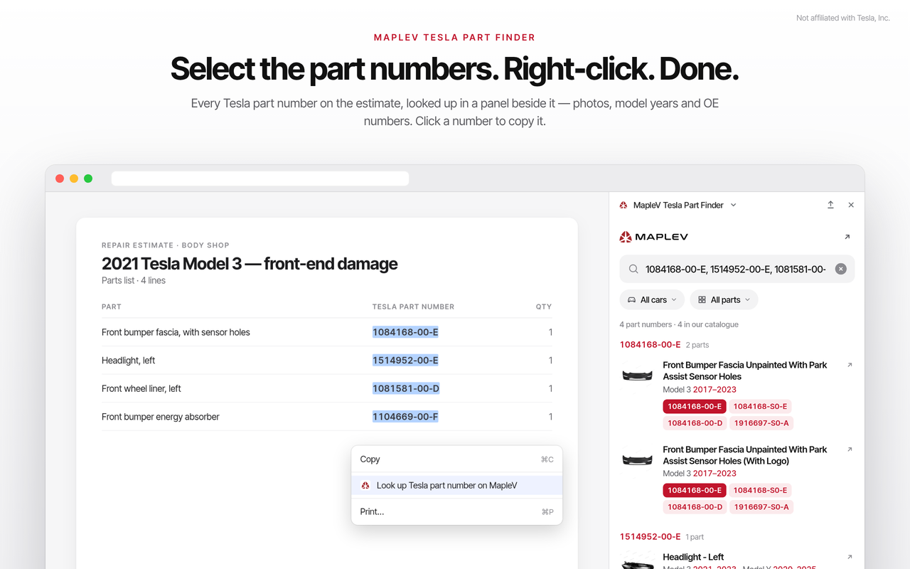

# Tesla Part Finder — free Tesla Model 3 and Model Y part number lookup (browser extension, PWA, embed)

**Find any Tesla Model 3 or Model Y collision part** by car, part type, Tesla OE part
number or Partslink number: in a browser toolbar popup (Chrome, Edge, Brave, Opera,
Firefox), from the right-click menu on any part number, as an app on your phone, or in a
box on your own website. Free, no account. Built by MapleV, a Tesla collision parts
supplier in British Columbia, Canada; the data is the open
[Tesla OE cross-reference dataset](https://github.com/maplev-ca/tesla-oe-cross-reference).

Keywords: Tesla part finder · Tesla OE part number lookup · Tesla Model 3 parts ·
Tesla Model Y parts · Partslink · collision parts · Chrome extension · Firefox add-on ·
PWA · Canada



## What it does

- Click the toolbar button (or press Alt+Shift+T), pick the car and the part type, or
  type a Tesla OE number or a part name. Each result shows a photo, the model years it
  fits and its Tesla OE numbers, with a link to the part's page on maplev.ca.
- Select a part number on any web page (a collision estimate, a listing, a forum post),
  right-click and choose **Look up Tesla part number on MapleV**. Several numbers in one
  selection are looked up together.
- Numbers work with or without dashes. The first seven digits list every version of a part.
- English and French, following the browser's language.

## Install

- **Chrome, Edge, Opera, Brave:** the store links will be added here once the listings
  are live. Until then: on this page choose **Code → Download ZIP** and unzip it, open
  `chrome://extensions`, turn on Developer mode, choose **Load unpacked** and pick the
  `extension` folder.
- **Firefox:** the store link will be added here once the listing is live.
- **iPhone and Android:** phones cannot install browser extensions, so the same finder
  installs as an app instead. Open
  [maplev.ca/embed/oe-lookup?src=pwa&install=1](https://maplev.ca/embed/oe-lookup?src=pwa&install=1):
  on Android, Chrome and Edge tap **Install**; on an iPhone, tap **Share**, then
  **Add to Home Screen**.

## Add the finder to your website

Paste this into any page that accepts HTML. It loads from maplev.ca, so new parts and
corrected numbers appear on your page with no work on your side.

```html
<iframe src="https://maplev.ca/embed/oe-lookup" title="Find a Tesla part" width="100%" height="540" loading="lazy" style="max-width:640px;border:1px solid #e5e5e5;border-radius:12px"></iframe>
<p style="margin:6px 0 0;font:13px/1.4 Arial,sans-serif;color:#555">Tesla part finder by <a href="https://maplev.ca/oe-lookup/">MapleV</a></p>
```

French:

```html
<iframe src="https://maplev.ca/embed/oe-lookup-fr" title="Trouver une pièce Tesla" width="100%" height="540" loading="lazy" style="max-width:640px;border:1px solid #e5e5e5;border-radius:12px"></iframe>
<p style="margin:6px 0 0;font:13px/1.4 Arial,sans-serif;color:#555">Recherche de pièces Tesla par <a href="https://maplev.ca/fr/oe-lookup/">MapleV</a></p>
```

More: [Free Tesla part finder](https://maplev.ca/guides/free-tesla-part-finder/).

## Privacy

- The only permission is the right-click menu entry (`contextMenus`).
- The extension does not read or change the pages you visit, and it stores nothing.
- The text you select is used only to open the lookup page, and only when you choose the
  menu entry.
- The popup loads the finder from maplev.ca like any web page.

Privacy policy: [maplev.ca/policies/privacy](https://maplev.ca/policies/privacy).

## What is in this repository

| Folder | Contents |
| --- | --- |
| `extension/` | The exact files in the Chrome Web Store package (also used for Edge and Opera) |
| `firefox/manifest.json` | The manifest of the Firefox package; every other file is the same as in `extension/` |
| `docs/` | Screenshots |

The parts data the finder shows is also published as a dataset under CC BY 4.0, in the
`tesla-oe-cross-reference` repository.

## Not affiliated with Tesla

MapleV is an independent supplier of aftermarket replacement parts and is not
affiliated with, endorsed by, or authorized by Tesla, Inc. Tesla, Model 3 and Model Y
are trademarks of Tesla, Inc. OE numbers are shown for identification and
cross-reference only; a matching number is a search key, not proof of fit.

## Licence

© 2026 MapleV. All rights reserved; see [LICENSE](LICENSE). Questions:
[maplev.ca/contact](https://maplev.ca/contact/).
